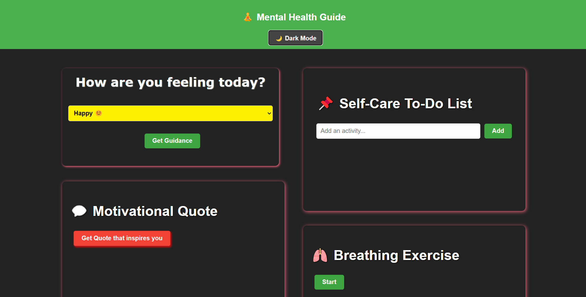

# MentalHealthGuide
 - The Mental Health Guide is a web-based application designed to provide users with personalized guidance based on their mood. It also includes features for self-care, such as a to-do list and a breathing exercise timer.

# Features
 1. Mood Selector: Users can select their current mood and receive tailored guidance.
 2. Motivational Quotes: Get inspiring quotes to uplift your spirits.
 3. Self-Care To-Do List: Add, edit, and delete self-care activities.
 4. Breathing Exercise: A timer for guided breathing exercises to promote relaxation.
 5. Dark Mode: Toggle between light and dark themes for better accessibility

# Technologies Used
 - HTML
 - CSS
 - JavaScript

# view here: https://nandinee-sharma.github.io/MentalHealthGuide/

# Preview

# Clone the repository
 - git clone https://github.com/Nandinee-Sharma/MentalHealthGuide.git

# Usage
 - Select your mood from the dropdown menu to receive guidance.
 - Click on "Get Quote" to display a motivational quote.
 - Use the to-do list to manage self-care activities.
 - Start the breathing exercise to practice mindfulness.

# Contributing
Contributions are welcome! Please open an issue or submit a pull request for any enhancements or bug fixes.